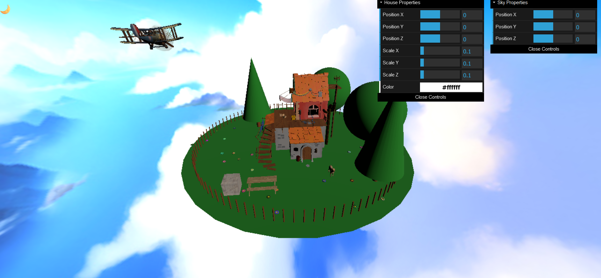
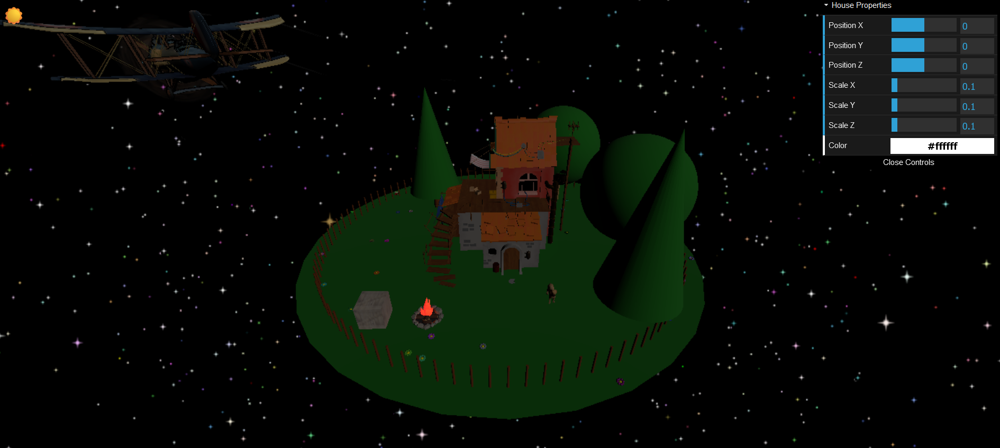

# Proiect Three.js: Scena Interactiva Padure Zi si Noapte

Acest proiect consta intr-o aplicatie web interactiva creata cu Three.js, care reprezinta o scena intr-o padure, impartita in doua moduri: zi si noapte. Scena de baza este definita in doua componente principale: ForestSceneDay si ForestSceneNight, fiecare cu propriile elemente specifice.

## Caracteristici Principale
- **Scena de baza**: Include setarile camerei, lumini si elementul de sol (Ground), care genereaza un teren circular, un gard si flori distribuite aleatoriu.
- **Modele 3D externe**: Utilizarea de modele .glb (ex: catelusul, casa, avionul, cerul si masa in scena de zi, focul in scena de noapte) incarcate cu GLTFLoader.
- **Manipularea obiectelor 3D**: Rotirea scenei utilizand tastele sageata stanga si dreapta pentru a vizualiza scena din diverse unghiuri.
- **Materiale si texturi**: Utilizarea de MeshStandardMaterial si TextureLoader pentru a aplica texturi specifice elementelor peisajului.
- **Lumina**: Scena de zi foloseste lumina directionala si ambientala pentru a simula lumina naturala, iar scena de noapte foloseste lumini cu intensitate redusa pentru a simula efectul de seara. De asemenea, un efect dinamic de foc este creat prin variatia intensitatii unei lumini punctiforme.
- **Animatii**: Avionul este animat pentru a zbura in cerc folosind functiile sin si cos pentru a calcula pozitiile pe un cerc.
- **Particule**: Componenta StarField genereaza un camp de stele care simuleaza efectul de clipocire sau stralucire.
- **Controale dat.gui**: Controale pentru ajustarea proprietatilor obiectelor 3D (pozitie, scalare, culoare) in timp real in componentele House si Sky.

## Structura Proiectului
- **ForestSceneDay si ForestSceneNight**: Componente principale pentru scena de zi si de noapte.
- **Ground**: Componenta care genereaza terenul, gardul si florile.
- **Modele 3D externe**: Componente individuale pentru fiecare model extern (ex: Dog, House, Airplane, Sky, Table, Fire).
- **Animatii**: Functii si hook-uri pentru animatia continua a avionului.
- **Particule**: Componenta StarField pentru generarea si animarea stelelor.
- **Controale**: Implementarea controalelor dat.gui pentru ajustarea proprietatilor obiectelor in scene.

## Tehnologii Utilizate
- **Three.js**: Biblioteca principala pentru crearea si manipularea scenelor 3D.
- **React**: Pentru structura modulara si gestionarea componentelor.
- **GLTFLoader**: Pentru incarcarea modelelor 3D externe in format .glb.
- **dat.gui**: Pentru crearea de controale interactive pentru obiectele 3D.

## Capturi de Ecran
## Modul de zi

## Modul de noapte
